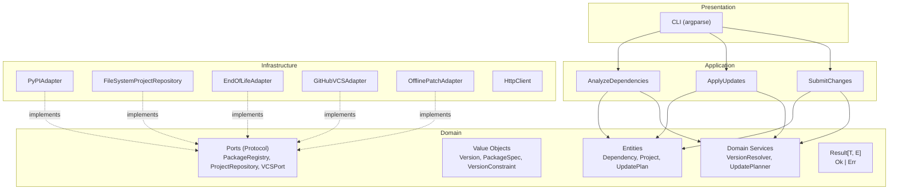

# System Overview

dependapy v0.2.0 is built on a strict **Onion Architecture** (Ports & Adapters)
with four clearly separated layers.

## Architecture Diagram



## Layer Responsibilities

| Layer | Responsibility | May Import |
|---|---|---|
| **Domain** | Entities, value objects, ports, services, errors | `stdlib`, `packaging` only |
| **Application** | Use cases, DTOs, orchestration | Domain |
| **Infrastructure** | Adapters for external systems | Domain, Application |
| **Presentation** | CLI entry point | Application, Config, Bootstrap |

## Dependency Rule

```
Presentation  ────►  Application  ────►  Domain  ◄────  Infrastructure
                                           ▲
                                           │
                              Only stdlib + packaging
```

The domain **never** imports from application, infrastructure, or presentation.
Infrastructure adapters implement domain ports — the domain depends on
abstractions, not implementations.

## Key Design Decisions

| Decision | Choice | Rationale |
|---|---|---|
| Architecture | Onion (Ports & Adapters) | Multi-provider support, testability |
| Error Handling | `Result[T, E]` | Type-safe, no exceptions for control flow |
| Version Type | `packaging.Version` wrapper | PEP 440 compliance, avoids NIH |
| Config | pydantic-settings | Validated, typed, `.env` support |
| HTTP | `requests` with retry | Stable, well-tested (httpx planned for v0.3) |
| VCS Port | Single unified Protocol | Pragmatic for 2–3 adapters |
| Enforcement | import-linter (3 contracts) | Prevents accidental layer violations |

## Package Structure

```
dependapy/
├── domain/
│   ├── models.py           # Dependency, Project, UpdatePlan
│   ├── value_objects.py     # Version, PackageSpec, VersionConstraint
│   ├── services.py          # VersionResolver, UpdatePlanner
│   ├── ports.py             # Protocol interfaces
│   ├── errors.py            # Domain error hierarchy
│   └── result.py            # Result[T, E] = Ok | Err
├── application/
│   ├── use_cases.py         # AnalyzeDependencies, ApplyUpdates, SubmitChanges
│   ├── dtos.py              # AnalysisResult, SubmitResult
│   └── config.py            # AppConfig (pydantic-settings)
├── infrastructure/
│   ├── adapters/
│   │   ├── pypi.py          # PyPIAdapter → PackageRegistry
│   │   ├── endoflife.py     # EndOfLifeAdapter → PythonVersionRegistry
│   │   ├── filesystem.py    # FileSystemProjectRepository → ProjectRepository
│   │   └── policy_loader.py # YAMLPolicyLoader → PolicyLoader
│   ├── vcs/
│   │   ├── github.py        # GitHubVCSAdapter → VCSPort
│   │   ├── offline.py       # OfflinePatchAdapter → VCSPort
│   │   └── git_client.py    # Git subprocess wrapper
│   └── http.py              # HttpClient with retry
├── presentation/
│   └── cli.py               # CLI entry point
├── bootstrap.py             # Composition root
└── main.py                  # Thin entry → cli_main
```

---

[**Onion Layers →**](onion-layers.md){ .md-button }
[**Ports & Adapters →**](ports-adapters.md){ .md-button }
[**Result Pattern →**](result-pattern.md){ .md-button }
