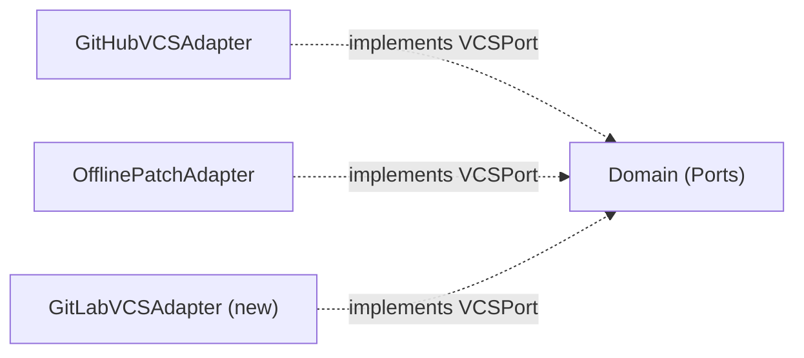

# Ports & Adapters

The Ports & Adapters pattern (Hexagonal Architecture) is the foundation
of dependapy's design. Domain logic defines **ports** (abstract interfaces);
infrastructure provides **adapters** (concrete implementations).

## Ports — Domain Protocols

All ports are defined in `dependapy/domain/ports.py` as
`@runtime_checkable` Protocol classes.

### PackageRegistry

```python
@runtime_checkable
class PackageRegistry(Protocol):
    def get_latest_version(self, name: str) -> Result[Version, str]: ...
    def get_latest_versions_batch(
        self, names: list[str]
    ) -> dict[str, Result[Version, str]]: ...
```

**Purpose**: Fetch the latest version of a Python package.

**Adapters**:

- `PyPIAdapter` — Queries `https://pypi.org/pypi/{name}/json` with
  caching, parallel batch via `ThreadPoolExecutor`

### ProjectRepository

```python
@runtime_checkable
class ProjectRepository(Protocol):
    def find_project_files(self, root: Path) -> Result[list[Path], str]: ...
    def load_project(self, path: Path) -> Result[Project, str]: ...
    def save_project(self, project: Project) -> Result[None, str]: ...
```

**Purpose**: Load and save `pyproject.toml` project files.

**Adapters**:

- `FileSystemProjectRepository` — Reads with `tomllib`, writes with regex
  replacement (preserves formatting)

### VCSPort

```python
@runtime_checkable
class VCSPort(Protocol):
    def create_branch(self, name: str) -> Result[None, str]: ...
    def commit_and_push(
        self, message: str, files: list[Path]
    ) -> Result[None, str]: ...
    def create_pull_request(
        self, title: str, body: str, branch: str
    ) -> Result[str, str]: ...
```

**Purpose**: Version control operations — branch, commit, push, PR.

**Adapters**:

- `GitHubVCSAdapter` — Uses PyGithub to create PRs via GitHub API.
  Queries the API for the repo's default branch with fallback to `"main"`.
- `OfflinePatchAdapter` — Uses `git format-patch` to generate portable
  patch files. No API access required.

### PythonVersionRegistry

```python
@runtime_checkable
class PythonVersionRegistry(Protocol):
    def get_supported_versions(self) -> Result[list[Version], str]: ...
```

**Purpose**: Fetch currently supported Python versions.

**Adapters**:

- `EndOfLifeAdapter` — Queries `https://endoflife.date/api/python.json`
  with caching and fallback to built-in defaults.

## Adapter Wiring — Bootstrap

The composition root (`bootstrap.py`) wires adapters to ports:

```python
def bootstrap(config: AppConfig) -> Application:
    http = HttpClient(timeout=config.api_timeout)
    registry = PyPIAdapter(http, config.pypi_base_url)
    repo = FileSystemProjectRepository()
    eol = EndOfLifeAdapter(http, config.python_eol_api_url)

    match config.vcs_provider:
        case VCSProvider.GITHUB:
            vcs = GitHubVCSAdapter(config.vcs_token, ...)
        case VCSProvider.OFFLINE:
            vcs = OfflinePatchAdapter(...)

    return Application(
        analyze=AnalyzeDependencies(repo, registry, eol),
        apply=ApplyUpdates(repo),
        submit=SubmitChanges(vcs),
    )
```

## Adding a New Adapter

To add support for a new VCS provider (e.g., GitLab):

1. Create `dependapy/infrastructure/vcs/gitlab.py`
2. Implement the `VCSPort` protocol
3. Add a `GITLAB` variant to `VCSProvider` in `config.py`
4. Add a `case VCSProvider.GITLAB:` branch in `bootstrap.py`

The domain and application layers remain untouched.


