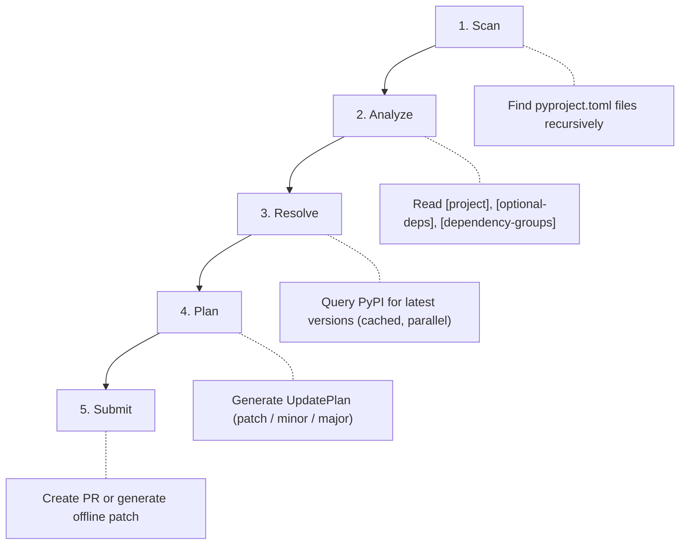

# User Guide

Welcome to the dependapy user guide. This section covers day-to-day usage
for teams and operators.

## How dependapy Works

### Step-by-Step

1. **Scan** — Recursively walks the repository and finds all `pyproject.toml` files
2. **Analyze** — Parses each file's `[project].dependencies`,
   `[project.optional-dependencies]`, and `[dependency-groups]` sections
3. **Resolve** — Queries PyPI in parallel (with caching) for the latest version
   of each package. Also checks endoflife.date for Python version support.
4. **Plan** — Generates an `UpdatePlan` for each project. Each dependency
   update is classified as `patch`, `minor`, or `major`.
5. **Submit** — Depending on the VCS provider:
    - **GitHub**: Creates a branch, commits the changes, pushes, and opens a PR
    - **Offline**: Generates a `git format-patch` file

## Guides

| Guide | Description |
|---|---|
| [Offline Mode](offline-mode.md) | Work without GitHub API access |
| [UV Integration](uv-integration.md) | Use dependapy with the `uv` package manager |
| [Policy & Governance](policy.md) | Dependency management policies for teams |
