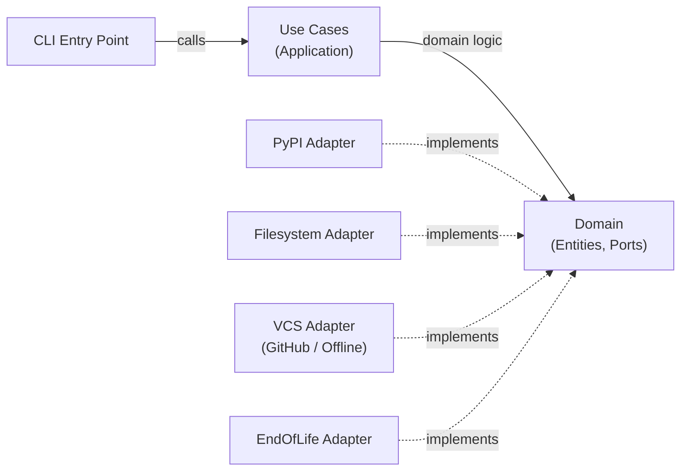

---
hide:
  - navigation
  - toc
---

# dependapy

## Scan. Analyze. Update. — Automatically.

dependapy is a **Python dependency governance platform** that keeps your
`pyproject.toml` dependencies up to date — automatically, safely, and with
full transparency.

**No vendor lock-in. No cloud dependency. Works offline.**

---

## Who Is dependapy For?

<div class="grid" markdown>

<div class="card" markdown>
### :material-account-group: Engineering Teams
Keep dependencies current across all your Python projects.
Get pull requests with version bumps — reviewed, tested, merged.
No more "we'll update next sprint" debt.
</div>

<div class="card" markdown>
### :material-shield-check-outline: Security-Conscious Orgs
Outdated dependencies are a top attack vector.
dependapy scans weekly (or on demand) and surfaces every outdated package
with its current and latest version.
</div>

<div class="card" markdown>
### :material-cog-outline: DevOps & Platform Engineers
Run dependapy as a GitHub Action on a schedule.
Integrate it into any CI/CD pipeline — or generate offline patches
when GitHub API access isn't available.
</div>

</div>

---

## What Can You Do With dependapy?

| Capability | What It Means For You |
|---|---|
| :material-magnify: **Dependency Scanning** | Recursively finds all `pyproject.toml` files — project deps, optional extras, and dev groups |
| :material-snake: **Python Version Check** | Ensures your `requires-python` covers the three latest Python 3 minor releases via endoflife.date |
| :material-update: **Smart Updates** | Generates `UpdatePlan` with patch/minor/major classification — you control what gets bumped |
| :material-source-pull: **Automatic PRs** | Creates a branch, commits changes, and opens a pull request via GitHub API |
| :material-file-document-edit: **Offline Patches** | No API access? Generate a `git format-patch` and apply it later |
| :material-package-variant: **uv Compatible** | Works seamlessly with the modern `uv` package manager from Astral |
| :material-robot: **GitHub Action** | Schedule weekly runs — zero maintenance, always current |

---

## Built Right

<div class="stat-grid" markdown>

<div class="stat" markdown>
<span class="number">178</span>
<span class="label">Tests</span>
</div>

<div class="stat" markdown>
<span class="number">91%</span>
<span class="label">Coverage</span>
</div>

<div class="stat" markdown>
<span class="number">4</span>
<span class="label">Onion Layers</span>
</div>

<div class="stat" markdown>
<span class="number">3/3</span>
<span class="label">Import Contracts</span>
</div>

</div>

dependapy v0.2.0 is built on a strict **Onion Architecture** with
Protocol-based ports, a `Result[T, E]` error pattern, and import-linter
enforcement. No exceptions for control flow. No God classes.

---

## Architecture at a Glance



| Layer | Responsibility |
|---|---|
| **Domain** | Entities, value objects, ports (Protocol), services — no external imports |
| **Application** | Use cases: `AnalyzeDependencies`, `ApplyUpdates`, `SubmitChanges` |
| **Infrastructure** | PyPI, filesystem, GitHub/offline VCS, HTTP client with retry |
| **Presentation** | CLI with `argparse` — backward-compatible with v0.1.x |

[**Architecture Deep Dive →**](architecture/overview.md){ .md-button }

---

## Get Started in 2 Minutes

=== "From PyPI"

    ```bash
    # Install with uv (recommended)
    uv add dependapy

    # Or with pip
    pip install dependapy
    ```

=== "From Source"

    ```bash
    git clone https://github.com/stefanposs/dependapy.git
    cd dependapy
    uv pip install -e ".[dev]"
    ```

=== "GitHub Action"

    ```yaml
    name: Dependapy
    on:
      schedule:
        - cron: '0 2 * * 0'  # Weekly
      workflow_dispatch:
    jobs:
      update:
        runs-on: ubuntu-latest
        permissions:
          contents: write
          pull-requests: write
        steps:
          - uses: actions/checkout@v4
          - uses: actions/setup-python@v5
            with:
              python-version: '3.13'
          - run: pip install dependapy
          - run: dependapy
            env:
              DEPENDAPY_VCS_TOKEN: ${{ secrets.GITHUB_TOKEN }}
    ```

[**Quick Start Guide →**](getting-started/quick-start.md){ .md-button .md-button--primary }
[**View on GitHub →**](https://github.com/stefanposs/dependapy){ .md-button }

---

## Documentation Map

| Section | For | What You'll Find |
|---|---|---|
| [Getting Started](getting-started/installation.md) | Everyone | Install, configure, first run |
| [User Guide](guide/index.md) | Operators & Teams | Offline mode, uv integration, governance policies |
| [Architecture](architecture/overview.md) | Developers | Onion layers, ports & adapters, Result pattern |
| [Development](development/contributing.md) | Contributors | Testing, code quality, how to contribute |

---

## Built With

<div class="grid" markdown>
<div class="card" markdown>
:material-language-python: **Python 3.12+** — Clean, typed, modern
</div>
<div class="card" markdown>
:material-package-variant: **packaging** — PEP 440 version handling
</div>
<div class="card" markdown>
:material-shield-lock: **pydantic-settings** — Validated configuration
</div>
<div class="card" markdown>
:material-test-tube: **pytest** — 178 tests, 91% coverage
</div>
</div>

---

## License

MIT — see [LICENSE](https://github.com/stefanposs/dependapy/blob/main/LICENSE) for details.
