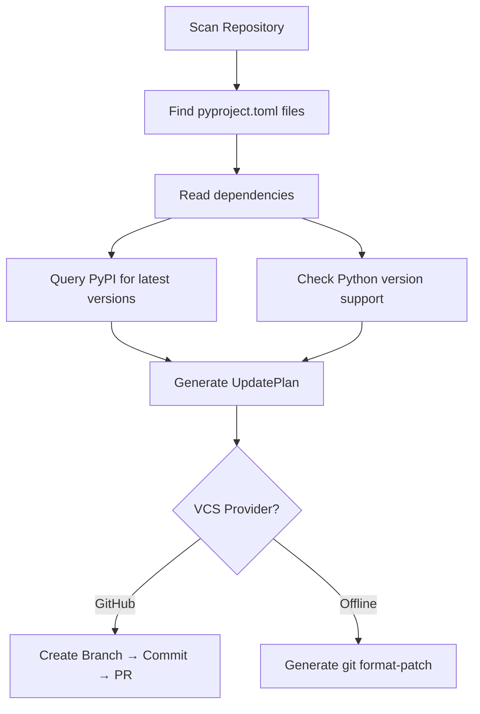

# Why dependapy?

## The Problem

Every Python project has dependencies. And every dependency eventually becomes
outdated — sometimes within weeks.

**What happens when you don't update?**

- :material-shield-alert: **Security vulnerabilities** accumulate silently
- :material-bug: **Compatibility issues** compound — the longer you wait, the harder the upgrade
- :material-clock-alert: **Technical debt** grows until "just update everything" becomes a multi-sprint epic
- :material-alert-circle: **Python version drift** — your `requires-python` falls behind, blocking adoption of new features

## Why Not Just Use Dependabot?

Dependabot is great — for npm, Cargo, and Go. For Python `pyproject.toml` projects,
it has limitations:

| Feature | Dependabot | dependapy |
|---|---|---|
| `pyproject.toml` scanning | Partial | Full (`[project]`, `[project.optional-dependencies]`, `[dependency-groups]`) |
| Python version governance | No | Yes — checks the 3 latest Python versions via endoflife.date |
| Offline / air-gapped mode | No | Yes — `git format-patch` for environments without API access |
| Architecture | Closed-source SaaS | Open-source, Onion Architecture, fully extensible |
| VCS providers | GitHub only | GitHub + Offline (GitLab, Bitbucket planned) |
| Custom policies | Limited | Configurable via YAML (planned) |

## What dependapy Does



1. **Scan** — Recursively finds all `pyproject.toml` files
2. **Analyze** — Reads project dependencies, optional extras, and dev groups
3. **Resolve** — Queries PyPI (with caching and parallel batch) for latest versions
4. **Classify** — Tags each update as patch, minor, or major
5. **Plan** — Generates an `UpdatePlan` with state machine transitions (DRAFT → APPROVED → APPLIED)
6. **Submit** — Creates a PR on GitHub or generates an offline patch

## Design Principles

### Result Pattern — No Exceptions for Control Flow

```python
result = registry.get_latest_version("requests")
match result:
    case Ok(version):
        print(f"Latest: {version}")
    case Err(error):
        logger.warning(f"Failed: {error}")
```

Every operation returns `Ok[T] | Err[E]`. No sentinel values, no bare `except Exception`.

### Onion Architecture — Clean Layer Boundaries

```
┌──────────────────────────────────────────────┐
│             Presentation (CLI)               │
├──────────────────────────────────────────────┤
│          Application (Use Cases)             │
├──────────────────────────────────────────────┤
│  Infrastructure (PyPI, GitHub, Filesystem)   │
├──────────────────────────────────────────────┤
│          Domain (Entities, Ports)            │
└──────────────────────────────────────────────┘
```

The domain **never** imports from infrastructure. Enforced by 3 import-linter contracts.

### Protocol Ports — Dependency Inversion

```python
@runtime_checkable
class PackageRegistry(Protocol):
    def get_latest_version(self, name: str) -> Result[Version, str]: ...
    def get_latest_versions_batch(self, names: list[str]) -> dict[str, Result[Version, str]]: ...
```

Swap PyPI for a local mirror, a cache, or a mock — the domain doesn't care.

---

[**Get Started →**](getting-started/installation.md){ .md-button .md-button--primary }
[**View Architecture →**](architecture/overview.md){ .md-button }
